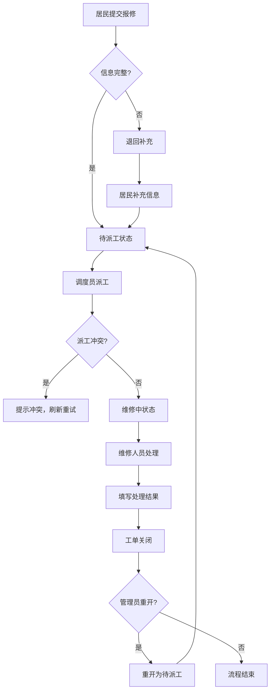

## 1. 产品概述

社区报修派单系统是一个面向社区居民、调度员、维修人员和管理员的工单管理平台，支持从报修提交到工单关闭的全流程跟踪，涵盖派工、维修、退回、重开等多种业务场景。

- 核心目标：实现社区报修工单的数字化管理，提高派工效率，保障工单可追溯
- 目标用户：社区居民、调度员、维修人员、系统管理员
- 核心价值：角色权限隔离、流程规范化、操作全程可审计、离线草稿保障

## 2. 核心功能

### 2.1 用户角色

| 角色 | 登录方式 | 核心权限 |
|------|----------|----------|
| 居民 | 账号密码 | 提交报修、查看我的工单、草稿保存与恢复 |
| 调度员 | 账号密码 | 查看全部工单、派工给维修人员、退回工单补充信息 |
| 维修人员 | 账号密码 | 查看被派工单、填写处理结果、关闭工单 |
| 管理员 | 账号密码 | 重开已关闭工单、查看操作日志、导出工单数据、用户管理 |

### 2.2 功能模块

1. **登录页**：角色选择登录、身份校验
2. **居民工作台**：提交报修、我的工单列表、草稿箱
3. **调度员工作台**：工单池、派工操作、退回操作、冲突提示
4. **维修人员工作台**：待处理工单、填写处理结果、关闭工单
5. **管理员工作台**：工单重开、操作日志、数据导出、用户管理

### 2.3 页面详情

| 页面名称 | 模块名称 | 功能描述 |
|-----------|-------------|---------------------|
| 登录页 | 登录表单 | 账号密码登录、角色自动识别、错误提示 |
| 居民-提交报修 | 报修表单 | 标题、类别、地址、描述、图片上传、保存草稿、提交 |
| 居民-我的工单 | 工单列表 | 查看历史工单、状态筛选、详情查看 |
| 居民-草稿箱 | 草稿列表 | 离线草稿恢复、继续编辑、删除草稿 |
| 调度员-工单池 | 工单列表 | 全部工单、按状态筛选、搜索、详情查看 |
| 调度员-派工弹窗 | 派工表单 | 选择维修人员、派工备注、冲突检测提示 |
| 调度员-退回工单 | 退回表单 | 退回原因、退回给居民补充 |
| 维修员-待处理 | 工单列表 | 我负责的工单、待处理/已完成筛选 |
| 维修员-处理工单 | 处理表单 | 处理结果、完成时间、关闭工单 |
| 管理员-工单管理 | 工单列表 | 全部工单、重开已关闭工单 |
| 管理员-操作日志 | 日志列表 | 全量操作记录、按用户/类型筛选、时间排序 |
| 管理员-数据导出 | 导出功能 | 导出 CSV、导出范围选择 |

## 3. 核心流程

### 3.1 主流程
居民提交报修 → 调度员派工给维修人员 → 维修人员处理并填写结果 → 工单关闭

### 3.2 退回补充流程
居民提交报修 → 调度员审核发现信息不全 → 退回工单 → 居民补充信息后重新提交 → 调度员再次派工

### 3.3 管理员重开流程
工单已关闭 → 管理员发现问题 → 重开工单 → 重新进入派工/维修流程

### 3.4 派工冲突流程
调度员A打开工单详情 → 调度员B同时打开并完成派工 → 调度员A点击派工时 → 系统提示"工单状态已变更，请刷新后重试"

## 4. 用户界面设计

### 4.1 设计风格
- **主色调**：深蓝色系（#1e40af）代表专业、可信赖
- **辅助色**：橙色（#f97316）用于状态提醒和操作按钮
- **成功色**：绿色（#16a34a）、警告色：黄色（#ca8a04）、危险色：红色（#dc2626）
- **按钮风格**：圆角 8px，轻微阴影，悬停有过渡效果
- **字体**：系统无衬线字体，标题加粗，正文常规
- **布局风格**：左侧导航 + 右侧内容区，卡片式布局
- **图标**：Lucide 图标库，线性风格

### 4.2 页面设计概述

| 页面名称 | 模块名称 | UI 元素 |
|-----------|-------------|-------------|
| 登录页 | 登录卡片 | 居中卡片、渐变背景、表单输入、登录按钮、角色提示 |
| 工作台 | 侧边导航 + 内容区 | 顶部用户信息、侧边菜单、主内容区、状态标签卡片 |
| 工单列表 | 数据表格 | 筛选栏、搜索框、表格、分页、状态标签 |
| 工单详情 | 详情卡片 | 工单信息面板、时间线、操作按钮区 |
| 表单弹窗 | 模态框 | 标题、表单字段、底部操作按钮 |

### 4.3 响应式
- 桌面端优先设计（1280px 以上）
- 平板端自适应，侧边栏可折叠
- 移动端单列布局，底部导航

## 5. 数据持久化与一致性

### 5.1 离线草稿
- 报修表单支持自动保存草稿到 localStorage
- 页面刷新/浏览器重启后可恢复草稿
- 草稿包含表单所有字段及编辑时间

### 5.2 服务端数据
- 使用 SQLite 文件数据库，重启后数据不丢失
- 工单状态、操作日志、用户信息持久化存储
- 导出文件生成在服务端指定目录

### 5.3 操作日志
- 所有关键操作记录日志（创建、派工、处理、关闭、重开等）
- 日志按时间倒序排列，时间戳精确到秒
- 包含操作人、操作类型、工单ID、操作详情
