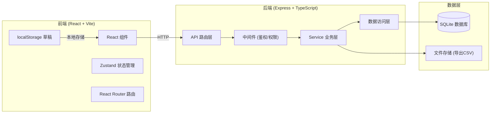
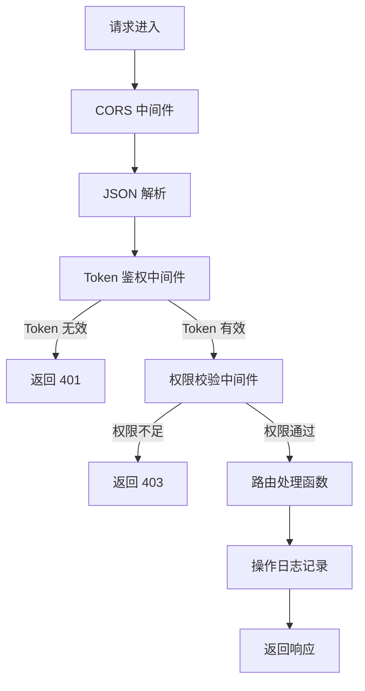
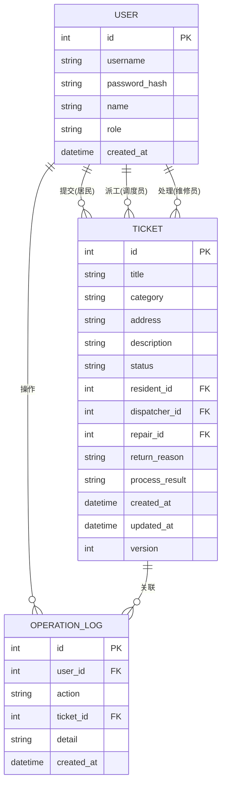

## 1. 架构设计



## 2. 技术描述

- **前端**：React 18 + TypeScript + Vite + TailwindCSS 3 + Zustand + React Router
- **后端**：Express 4 + TypeScript + better-sqlite3
- **数据库**：SQLite（文件型数据库，无需额外服务）
- **鉴权**：基于 Token 的会话管理（内存 + 数据库持久化）
- **样式**：TailwindCSS 3
- **图标**：Lucide React

## 3. 目录结构

```
.
├── src/                    # 前端源码
│   ├── components/         # 公共组件
│   ├── pages/              # 页面组件
│   ├── hooks/              # 自定义 Hooks
│   ├── store/              # Zustand 状态
│   ├── utils/              # 工具函数
│   ├── types/              # 类型定义
│   ├── App.tsx
│   └── main.tsx
├── api/                    # 后端源码
│   ├── routes/             # API 路由
│   ├── middleware/         # 中间件
│   ├── services/           # 业务逻辑
│   ├── db/                 # 数据库相关
│   ├── types/              # 类型定义
│   └── index.ts
├── shared/                 # 前后端共享类型
├── data/                   # SQLite 数据库文件
├── exports/                # 导出文件目录
├── vite.config.ts
├── tailwind.config.js
├── tsconfig.json
└── package.json
```

## 4. 路由定义

### 前端路由

| 路由 | 页面 | 权限角色 |
|-------|------|---------|
| /login | 登录页 | 公开 |
| /resident/dashboard | 居民-首页 | 居民 |
| /resident/submit | 居民-提交报修 | 居民 |
| /resident/tickets | 居民-我的工单 | 居民 |
| /resident/drafts | 居民-草稿箱 | 居民 |
| /dispatcher/dashboard | 调度员-首页 | 调度员 |
| /dispatcher/tickets | 调度员-工单池 | 调度员 |
| /repair/dashboard | 维修员-首页 | 维修人员 |
| /repair/tickets | 维修员-我的工单 | 维修人员 |
| /admin/dashboard | 管理员-首页 | 管理员 |
| /admin/tickets | 管理员-工单管理 | 管理员 |
| /admin/logs | 管理员-操作日志 | 管理员 |
| /admin/export | 管理员-数据导出 | 管理员 |

### 后端 API

| 方法 | 路径 | 说明 | 权限 |
|------|------|------|------|
| POST | /api/auth/login | 登录 | 公开 |
| POST | /api/auth/logout | 登出 | 登录用户 |
| GET | /api/auth/me | 获取当前用户 | 登录用户 |
| GET | /api/users | 获取用户列表 | 管理员 |
| GET | /api/users?role=repair | 获取维修人员列表 | 调度员 |
| POST | /api/tickets | 创建工单 | 居民 |
| GET | /api/tickets | 获取工单列表 | 按角色过滤 |
| GET | /api/tickets/:id | 获取工单详情 | 按角色 |
| PUT | /api/tickets/:id/assign | 派工 | 调度员 |
| PUT | /api/tickets/:id/return | 退回工单 | 调度员 |
| PUT | /api/tickets/:id/process | 处理工单 | 维修人员 |
| PUT | /api/tickets/:id/close | 关闭工单 | 维修人员 |
| PUT | /api/tickets/:id/reopen | 重开工单 | 管理员 |
| PUT | /api/tickets/:id/resubmit | 重新提交 | 居民（退回状态） |
| GET | /api/logs | 获取操作日志 | 管理员 |
| GET | /api/export/tickets | 导出战单 CSV | 管理员 |

## 5. 中间件架构



## 6. 数据模型

### 6.1 实体关系图



### 6.2 工单状态流转

| 状态 | 说明 | 可转换状态 |
|------|------|-----------|
| pending | 待派工 | assigned (派工) / returned (退回) |
| returned | 已退回 | pending (重新提交) |
| assigned | 已派工 | processing (开始处理) |
| processing | 处理中 | closed (关闭) |
| closed | 已关闭 | pending (管理员重开) |

### 6.3 派工冲突检测机制

- 工单表增加 `version` 字段（乐观锁）
- 派工时校验当前 version 是否与读取时一致
- 若不一致（其他调度员已修改），返回 409 冲突错误
- 前端提示用户刷新页面重试

### 6.4 DDL 语句

```sql
CREATE TABLE IF NOT EXISTS users (
  id INTEGER PRIMARY KEY AUTOINCREMENT,
  username TEXT UNIQUE NOT NULL,
  password_hash TEXT NOT NULL,
  name TEXT NOT NULL,
  role TEXT NOT NULL CHECK(role IN ('resident','dispatcher','repair','admin')),
  created_at DATETIME DEFAULT CURRENT_TIMESTAMP
);

CREATE TABLE IF NOT EXISTS tickets (
  id INTEGER PRIMARY KEY AUTOINCREMENT,
  title TEXT NOT NULL,
  category TEXT NOT NULL,
  address TEXT NOT NULL,
  description TEXT,
  status TEXT NOT NULL DEFAULT 'pending',
  resident_id INTEGER NOT NULL,
  dispatcher_id INTEGER,
  repair_id INTEGER,
  return_reason TEXT,
  process_result TEXT,
  created_at DATETIME DEFAULT CURRENT_TIMESTAMP,
  updated_at DATETIME DEFAULT CURRENT_TIMESTAMP,
  version INTEGER DEFAULT 1,
  FOREIGN KEY (resident_id) REFERENCES users(id),
  FOREIGN KEY (dispatcher_id) REFERENCES users(id),
  FOREIGN KEY (repair_id) REFERENCES users(id)
);

CREATE TABLE IF NOT EXISTS operation_logs (
  id INTEGER PRIMARY KEY AUTOINCREMENT,
  user_id INTEGER NOT NULL,
  action TEXT NOT NULL,
  ticket_id INTEGER,
  detail TEXT,
  created_at DATETIME DEFAULT CURRENT_TIMESTAMP,
  FOREIGN KEY (user_id) REFERENCES users(id),
  FOREIGN KEY (ticket_id) REFERENCES tickets(id)
);

CREATE INDEX idx_tickets_status ON tickets(status);
CREATE INDEX idx_tickets_resident ON tickets(resident_id);
CREATE INDEX idx_tickets_repair ON tickets(repair_id);
CREATE INDEX idx_logs_ticket ON operation_logs(ticket_id);
CREATE INDEX idx_logs_user ON operation_logs(user_id);
```

### 6.5 初始样例数据

| 用户名 | 密码 | 角色 | 姓名 |
|--------|------|------|------|
| resident1 | 123456 | 居民 | 张三 |
| resident2 | 123456 | 居民 | 李四 |
| dispatcher1 | 123456 | 调度员 | 王调度 |
| dispatcher2 | 123456 | 调度员 | 赵调度 |
| repair1 | 123456 | 维修人员 | 陈师傅 |
| repair2 | 123456 | 维修人员 | 刘师傅 |
| admin | 123456 | 管理员 | 系统管理员 |
